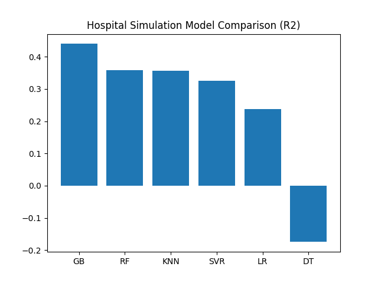
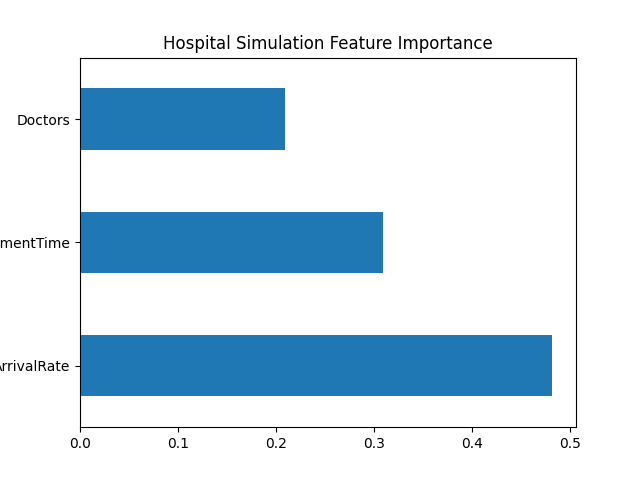

# Data Generation using Hospital Simulation for Machine Learning

This repository is created as submission for **Assignment-6 (UCS654)**.

------------------------------------------------------------------------

## 👤 Submitted By

-   **Name:** Naman Kumar\
-   **Roll Number:** 102317229

------------------------------------------------------------------------

## 1️⃣ Objective

The objective of this assignment is:

1.  To generate synthetic healthcare data using modelling and
    simulation.
2.  To perform 1000 hospital simulation runs.
3.  To train multiple Machine Learning models.
4.  To rank models using TOPSIS based on multiple evaluation criteria.

------------------------------------------------------------------------

## 2️⃣ Simulation Tool Used

SimPy -- A Python-based Discrete Event Simulation library.

SimPy was used to simulate a Hospital Emergency Department (ED) where: -
Patients arrive randomly (Poisson process). - Doctors act as limited
resources. - Treatment time depends on patient severity. - Average
waiting time is recorded.

------------------------------------------------------------------------

## 3️⃣ Simulation Design

The system models:

-   Random patient arrivals
-   Limited number of doctors
-   Variable treatment time
-   Queue-based waiting system

### Parameters and Bounds

  Parameter           Lower Bound   Upper Bound
  ------------------- ------------- -------------
  Arrival Rate        2             15
  Treatment Time      5             20
  Number of Doctors   1             6

Target Variable: - Average Waiting Time

Total simulations performed: 1000 runs

Generated Dataset: hospital_simulation_data.csv

------------------------------------------------------------------------

## 4️⃣ Machine Learning Models Used

The following regression models were trained:

-   Linear Regression
-   Decision Tree
-   Random Forest
-   Gradient Boosting
-   Support Vector Regression (SVR)
-   K-Nearest Neighbors (KNN)

------------------------------------------------------------------------

## 5️⃣ Evaluation Metrics

Models were compared using:

-   RMSE (to be minimized)
-   R² Score (to be maximized)
-   Training Time (to be minimized)
-   Prediction Time (to be minimized)

Results stored in: results.csv

------------------------------------------------------------------------

## 6️⃣ Model Performance Graph

The following graph compares R² performance of all models:

Higher R² indicates better predictive accuracy.

------------------------------------------------------------------------

## 7️⃣ Feature Importance

Feature importance was extracted using Random Forest:

This shows which hospital parameters most affect patient waiting time.

------------------------------------------------------------------------

## 8️⃣ TOPSIS Analysis

TOPSIS was applied to rank models based on multiple criteria.

### Weights Used:

0.35,0.35,0.15,0.15

### Impacts:

-,+,-,-

Criteria Meaning:

-   RMSE → Minimize
-   R² → Maximize
-   Training Time → Minimize
-   Prediction Time → Minimize

TOPSIS Output File: topsis_result.csv

------------------------------------------------------------------------

## 🏆 Final Result

The model ranked 1 by TOPSIS provides the best balance between:

-   Prediction accuracy
-   Computational efficiency
-   Training cost

------------------------------------------------------------------------

## 📌 Conclusion

1.  Hospital simulation successfully generated realistic synthetic data.
2.  Machine learning models effectively learned system behavior.
3.  TOPSIS provided an objective ranking mechanism.
4.  The selected model demonstrates the optimal trade-off between
    performance and efficiency.

------------------------------------------------------------------------

## 📂 Files Included

-   hospital_simulation_data.csv
-   results.csv
-   topsis_result.csv
-   model_comparison.png
-   feature_importance.png
-   code.ipynb
-   README.md
